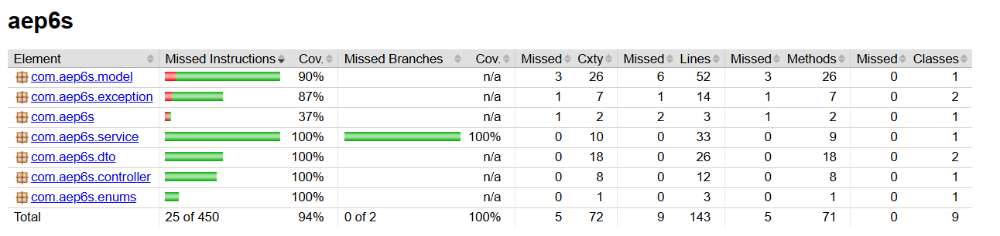

# AdotaPet 
**Onde histórias encontram um novo começo**

## Sobre o projeto
O **AdotaPet** é uma Prova de Conceito (PoC) desenvolvida em Java com 
Spring Boot para facilitar o cadastro e o gerenciamento de animais 
disponíveis para adoção.

A solução foi criada considerando as dificuldades enfrentadas por abrigos 
e protetores independentes na centralização e organização das informações 
de animais resgatados ou abandonados. Nesse contexto, a aplicação 
disponibiliza uma API REST capaz de cadastrar, consultar, atualizar e 
remover registros de animais, além de permitir a filtragem por status de
adoção e o registro de novas adoções.

A projeto está alinhado ao Objetivo de Desenvolvimento Sustentável (ODS) 
**11 — Cidades e Comunidades Sustentáveis**, pois contribui para uma organização 
mais eficiente de informações relacionadas ao bem-estar animal e à adoção responsável.


## Tecnologias utilizadas

- Java 17
- Spring Boot 3 (Web, Data MongoDB, Validation)
- MongoDB
- Maven
- JUnit 5 + Mockito (testes)
- JaCoCo (cobertura de testes)

## Arquitetura do projeto

A aplicação utiliza uma arquitetura em camadas. O controlador recebe
as requisições HTTP, o serviço executa as regras de negócio e o 
repositório realiza a comunicação com o MongoDB.

-   **Model:** representa os dados dos animais armazenados no MongoDB.
-   **DTO:** representa os dados recebidos nas requisições.
-   **Repository:** realiza a comunicação com o MongoDB.
-   **Service:** concentra as regras de negócio.
-   **Controller:** disponibiliza os endpoints da API.
-   **Exception:** trata erros e respostas de validação.
-   **Enum:** define os status de adoção.

``` text
src
├── main
│   ├── java
│   │   └── com.aep6s
│   │       ├── controller
│   │       ├── dto
│   │       ├── enums
│   │       ├── exception
│   │       ├── model
│   │       ├── repository
│   │       └── service
│   └── resources
│       └── application.properties
│
└── test
    └── java
        └── com.aep6s
            ├── controller
            ├── model
            └── service
```

## Banco de dados

A aplicação utiliza **MongoDB**, um banco de dados NoSQL. Ultilizamos uma única coleção
NoSQL, com objetos homogêneos e estrutura simples. Os dados de adoção
(status e nome do adotante) ficam embutidos como campos simples no próprio
documento do animal.

Banco utilizado:

``` text
adotapet
```

Coleção:

``` text
animais
```

Exemplo de documento:

``` json
{
  "_id": "id-do-animal",
  "nome": "Thor",
  "especie": "Cachorro",
  "raca": "Golden Retriever",
  "idade": 3,
  "porte": "Grande",
  "sexo": "Macho",
  "descricao": "Cachorro dócil e brincalhão",
  "status": "DISPONIVEL",
  "adotante": null,
  "dataCadastro": "2026-09-09"
}
```

## Endpoints

A API disponibiliza os seguintes endpoints:

| Método | Rota                  | Descrição                                   |
|--------|------------------------|----------------------------------------------|
| POST   | `/animais`             | Cadastrar um novo animal                      |
| GET    | `/animais`              | Listar todos os animais                       |
| GET    | `/animais/{id}`         | Buscar um animal por id                       |
| GET    | `/animais/status/{status}` | Listar por status (`DISPONIVEL`/`ADOTADO`) |
| PUT    | `/animais/{id}`         | Atualizar os dados de um animal               |
| PUT    | `/animais/{id}/adotar`  | Registrar a adoção (nome do adotante)         |
| DELETE | `/animais/{id}`         | Remover um animal                             |


## Exemplo de cadastro
Com o MongoDB e a aplicação em execução, utilize o seguinte 
fluxo no Postman.

### POST `/animais`

``` json
{
  "nome": "Thor",
  "especie": "Cachorro",
  "raca": "Golden Retriever",
  "idade": 3,
  "porte": "Grande",
  "sexo": "Macho",
  "descricao": "Cachorro dócil e brincalhão"
}
```

Após o cadastro, o sistema define automaticamente o status como
`DISPONIVEL` e registra a data de cadastro.

## Exemplo de adoção

### PUT `/animais/{id}/adotar`

``` json
{
  "adotante": "Maria Silva"
}
```

Quando a adoção é registrada, o status do animal é alterado para:

``` text
ADOTADO
```

e o nome do adotante é armazenado no registro.

Um animal que já esteja adotado não pode ser adotado novamente.

## Validação e tratamento de erros

A API utiliza validações para evitar dados inválidos, como:

-   Nome do animal obrigatório;
-   Espécie obrigatória;
-   Porte obrigatório;
-   Sexo obrigatório;
-   Idade não pode ser negativa;
-   Nome do adotante obrigatório ao registrar uma adoção.

Também existem tratamentos para situações como:

-   Animal não encontrado: `404 Not Found`;
-   Animal já adotado: `409 Conflict`;
-   Dados inválidos: `400 Bad Request`.

## Cobertura dos testes

Na versão atual da PoC, foram executados:

``` text
22 testes
0 falhas
0 erros
0 testes ignorados
```

A cobertura total registrada no relatório JaCoCo é de aproximadamente
**94%**, ultrapassando o mínimo de 70% exigido. Como pode ser observado
na imagem abaixo.



O relatório também pode ser executado e encontrado **após a execução dos testes** em:

``` text
target/site/jacoco/index.html
```

## Testes implementados

Os testes estão organizados por responsabilidade:

``` text
AnimalControllerTest
AnimalModelTest
AnimalServiceTest
Aep6sApplicationTests
```

Eles verificam funcionalidades relacionadas ao cadastro, consulta,
atualização, remoção, adoção, validações e regras de negócio da PoC.

## Como executar o projeto

### Pré-requisitos

Instale:

-   Java 17;
-   Maven;
-   MongoDB local;


### 1. Clonar o repositório

``` bash
git clone https://github.com/VihSouza06/AEP6S_AdotaPet.git
```


### 2. Configurar o MongoDB

A aplicação utiliza:

``` text
mongodb://localhost:27017/adotapet
```

Certifique-se de que o MongoDB esteja em execução na porta `27017`.

### 3. Executar a aplicação

No Windows:

``` bash
mvnw.cmd spring-boot:run
```

A API será executada na porta configurada no arquivo
`application.properties`.

## Como executar os testes

Para executar os testes:

``` bash
mvnw.cmd test
```

Para executar os testes e gerar o relatório de cobertura:

``` bash
mvnw.cmd clean test
```
### Se preferir rodar pela IntelliJ
Use o painel Maven.
No lado direito da IDEA tem uma aba `Maven`. 
Expanda `Lifecycle` > dê duplo clique em `test`.
Isso executa o mesmo ciclo do mvn clean test.

O projeto possui uma verificação do JaCoCo configurada para exigir
cobertura mínima de **70% das linhas**.

------------------------------------------------------------------------

**Projeto: AdotaPet \| AEP - Engenharia de Software 6S \| 2026.2**
